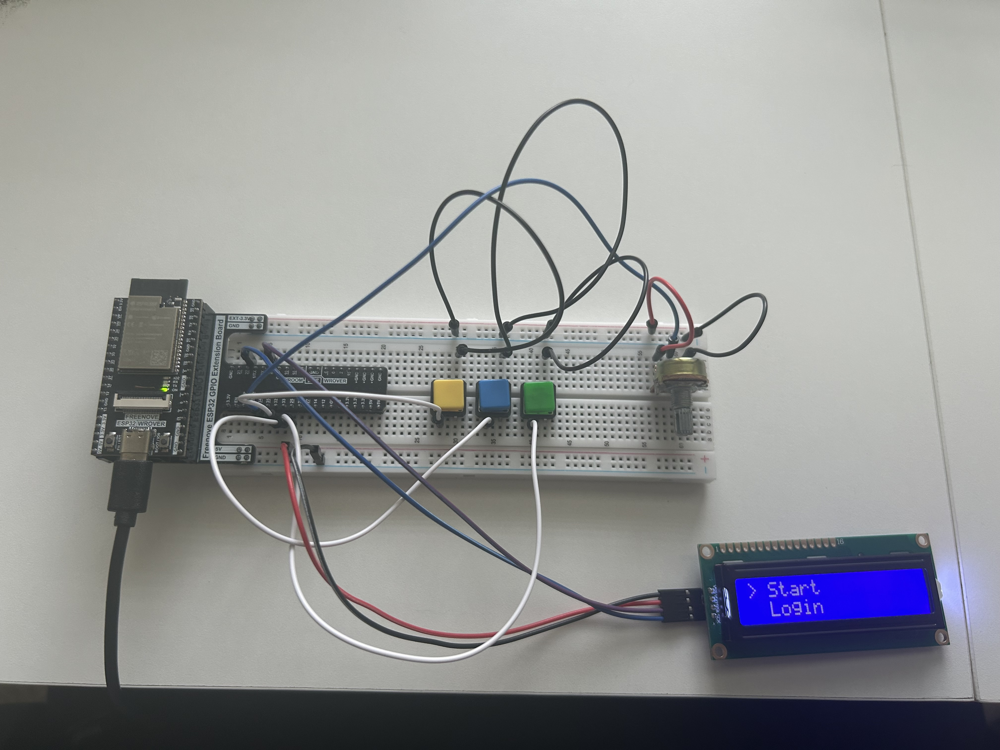

# LCD Menu Navigation

A simple menu interface using an ESP32, a 16x2 I²C LCD, push buttons, and a potentiometer. Users can navigate through options with either input options and confirm selections with a SELECT button.

## Components Used

- ESP32 Dev Kit
- 16x2 I²C LCD
- 3 push buttons
- Potentiometer
- Breadboard & Jumper Wires
- USB cable for power

## Visuals

### Circuitry


### Live Demo

[](https://www.youtube.com/watch?v=YA6rCyH0dgw&ab_channel=Agraw)

## Code Sample

``` c
if (digitalRead(BTN_SELECT) == LOW) {
    lcd.clear();
    lcd.setCursor(0,0);
    lcd.print("Selected: ");
    lcd.setCursor(0,1);
    lcd.print(menuItems[menuIndex]);
    delay(1000);
    displayMenu();
}
```

## Features

- LCD shows current and next menu items
- Menu options are controlled with:
  - Potentiometer (mapped to index range depending on number of menu items)
  - UP/DOWN buttons
- SELECT button confirms user choice