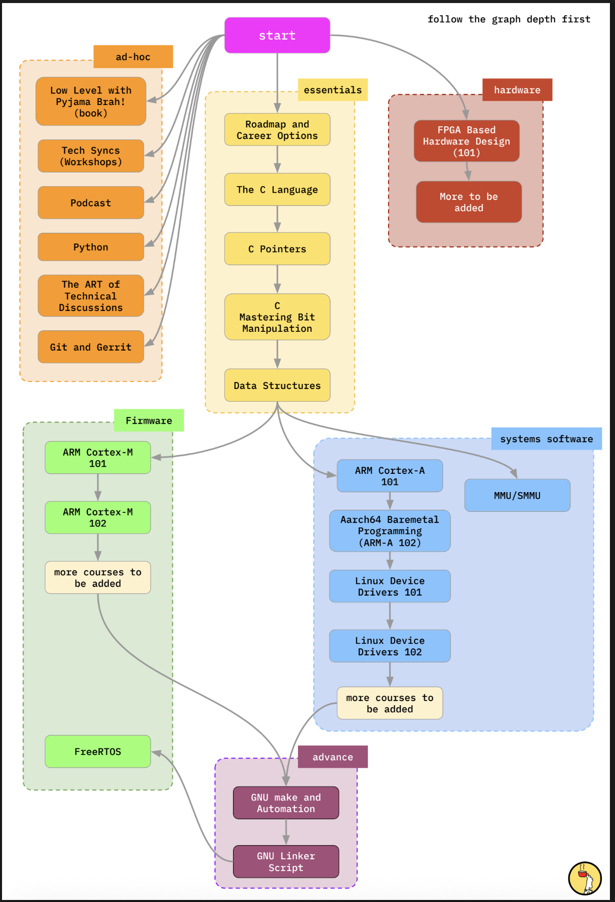

# PyjamaBrah Library

This repository documents my hands-on journey through the **PyjamaBrah Library Course**.  
I'm using this course to master everything from low-level C programming to firmware and systems software engineering.

## Contents

### Essentials
- Deep dive into the C language and pointer manipulation
- Bitwise operations and systems-level data structures
- Understanding embedded programming fundamentals

### Firmware Development
- ARM Cortex-M architecture (bare-metal programming)
- Memory-mapped I/O, interrupt handling, and peripherals
- Introduction to RTOS (FreeRTOS)

### System Software
- ARM Cortex-A and AArch64 bare-metal programming
- Linux kernel internals and device driver development
- Memory management units (MMU) and SMMU

### Tooling & Build Systems
- Makefiles, automation, and linker scripts
- Gaining mastery over low-level build and deployment tools

### Ad-hoc
- Python scripting for embedded workflows
- Git & Gerrit for team-based firmware development

## Course Roadmap

The visual roadmap below outlines the structure I’m following, where each module builds on the previous one:

